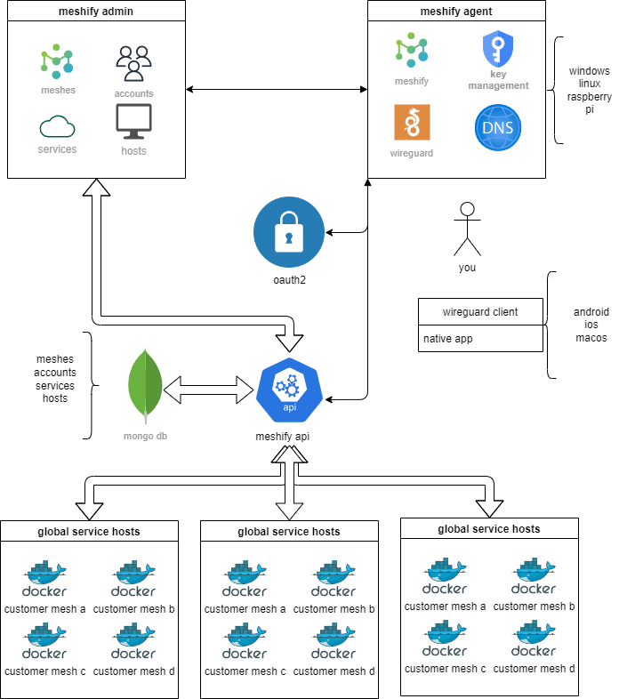
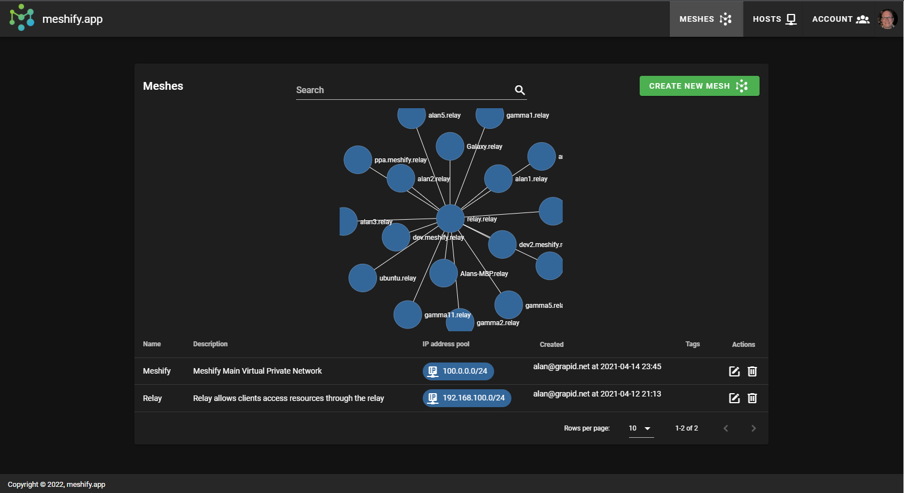

# Meshify

<h1 align="center"></h1>

A control plane for [WireGuard](https://wireguard.com).

## Why another one ?


All WireGuard UI implementations are trying to manage the service by applying configurations and creating network rules.
This implementation only generates configuration and its up to you to create network rules and apply configuration to WireGuard.
For example by monitoring generated directory with [inotifywait](https://github.com/inotify-tools/inotify-tools/wiki). 

## Features

 * Self-hosted and web based
 * Automatically select IP from the netowrk pool assigned to client
 * Enable / Disable client
 * Generation of configuration files on demand
 * IPv6 ready
 * User authentication (Oauth2 OIDC)
 * Dockerized
 * Pretty cool look





## Running


### Directly

Put everything in one directory, create `.env` file with all configurations and run the backend.

## Automatically apply changes to WireGuard

### Using ```systemd```
Using `systemd.path` monitor for directory changes see [systemd doc](https://www.freedesktop.org/software/systemd/man/systemd.path.html)
```
# /etc/systemd/system/wg-gen-web.path
[Unit]
Description=Watch /etc/wireguard for changes

[Path]
PathModified=/etc/wireguard

[Install]
WantedBy=multi-user.target
```
This `.path` will activate unit file with the same name
```
# /etc/systemd/system/wg-gen-web.service
[Unit]
Description=Restart WireGuard
After=network.target

[Service]
Type=oneshot
ExecStart=/usr/bin/systemctl restart wg-quick@wg0.service

[Install]
WantedBy=multi-user.target
```
Which will restart WireGuard service 

### Using ```inotifywait```
For any other init system, create a daemon running this script
```
#!/bin/sh
while inotifywait -e modify -e create /etc/wireguard; do
  wg-quick down wg0
  wg-quick up wg0
done
```

## How to use with existing WireGuard configuration

After first run Wg Gen Web will create `server.json` in data directory with all server informations.

Feel free to modify this file in order to use your existing keys

## What is out of scope

 * Currently out of scope is setting firewall marks (FwMark)

## Authentication

Wg Gen Web can use Oauth2 OpenID Connect provider to authenticate users.
Currently there are 4 implementations:
- `fake` not a real implementation, use this if you don't want to authenticate your clients.

Add the environment variable:

```
OAUTH2_PROVIDER_NAME=fake
```

- `github` in order to use GitHub as Oauth2 provider.

Add the environment variable:

```
OAUTH2_PROVIDER_NAME=github
OAUTH2_PROVIDER=https://github.com
OAUTH2_CLIENT_ID=********************
OAUTH2_CLIENT_SECRET=********************
OAUTH2_REDIRECT_URL=https://wg-gen-web-demo.127-0-0-1.fr
```

- `google` in order to use Google as Oauth2 provider. Not yet implemented
```
help wanted
```

- `oauth2oidc` in order to use RFC compliant Oauth2 OpenId Connect provider.

Add the environment variable:

```
OAUTH2_PROVIDER_NAME=oauth2oidc
OAUTH2_PROVIDER=https://gitlab.com
OAUTH2_CLIENT_ID=********************
OAUTH2_CLIENT_SECRET=********************
OAUTH2_REDIRECT_URL=https://wg-gen-web-demo.127-0-0-1.fr
```

Please fell free to test and report any bugs.
Wg Gen Web will only access your profile to get email address and your name, no other unnecessary scopes will be requested.

## Need Help

mailto:support@meshify.app

## Development

### Backend

From the top level directory run

```
$ go run main.go
```

### Frontend

Inside another terminal session navigate into the `ui` folder

```
$ cd ui
```
Install required dependencies
```
$ npm install
```
Set the base url for the api
```
$ export VUE_APP_API_BASE_URL=http://localhost:8080/api/v1.0
```
Start the development server. It will rebuild and reload the site once you make a change to the source code.
```
$ npm run serve
```

Now you can access the site from a webbrowser with the url `http://localhost:8081`.

## Application stack

 * [Gin, HTTP web framework written in Go](https://github.com/gin-gonic/gin)
 * [go-template, data-driven templates for generating textual output](https://golang.org/pkg/text/template/)
 * [Vue.js, progressive javaScript framework](https://github.com/vuejs/vue)
 * [Vuetify, material design component framework](https://github.com/vuetifyjs/vuetify)

## License

 * Do What the Fuck You Want to Public License. [LICENSE-WTFPL](LICENSE-WTFPL) or http://www.wtfpl.net
